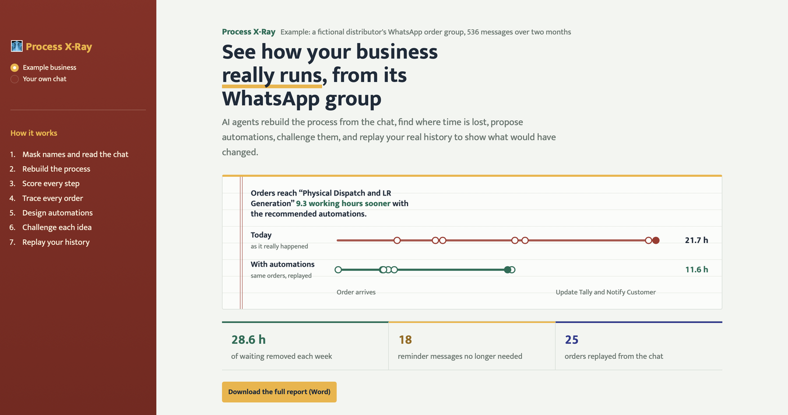

# 🩻 Process X-Ray

**Upload a WhatsApp group. See how the business really runs, where time is lost, and what automation would have changed, proven on its own history.**

[](https://process-xray.streamlit.app)
&nbsp;




---

## The problem

Millions of small Indian businesses (distributors, traders, manufacturers) don't run on ERPs. They run on **WhatsApp groups**: an order arrives as a PDF, someone asks the godown for stock, the owner approves the invoice hours later, someone chases the transporter, someone else chases the payment.

Enterprise process-mining tools like Celonis or task-mining tools need clean system logs or screen recording, so they can't see any of this. Owners feel the delays but can't measure them, and automation consultants guess.

## What Process X-Ray does

Export the group chat, upload it, and in a few minutes you get:

| | |
|---|---|
| 🗺️ **The real process** | Every step, who does it, in which tool, reconstructed from the conversation |
| ⏱️ **Measured waits** | How long each step really waits, in working hours, from real timestamps |
| 🛠️ **Ranked automations** | What to eliminate, simplify, integrate or automate, with build steps, tools and costs in rupees |
| 😈 **A devil's advocate** | A second agent attacks every idea: what breaks, who resists, and a verdict |
| 🔁 **The replay** | Your actual history, re-run as if the automations had existed: *"this order would have been dispatched 13 hours sooner"* |
| 📄 **A Word report** | The whole analysis as a document an owner can print or forward |

## Why it's different

**1. It reads the data small businesses actually have.** A WhatsApp export is a messy, interleaved, Hinglish event log. Process X-Ray turns it into a proper one: every order traced message by message, even when five orders are being discussed at once.

**2. Replay, not guesswork.** Most tools estimate savings with a formula. Process X-Ray re-runs the business's **own timeline**: only waits an automation directly controls are shortened, and everything else (customers paying, trucks arriving, physical work) keeps its real timing. The owner recognises every moment it shows.

**3. It's honest by design.** The AI is never trusted blindly. Every number passes through deterministic guardrails (see below), and a sceptical agent can mark ideas *Rethink*, which removes them from the savings.

**4. Private and free.** Names, customer names, phone numbers and emails are masked **before** any AI call; uploads are processed in memory and never stored. It runs on free tiers of Gemini and Groq, so visitors need no sign-up and no key.

## How it works

```mermaid
flowchart LR
    A[WhatsApp export] --> B[Parser<br/>mask names, phones, customers]
    B --> C[Mapper agent<br/>rebuilds the process]
    C --> D[Event-log agent<br/>traces every order, in chunks]
    D --> E[Measurement<br/>waits in working hours]
    E --> F[Analyst agent<br/>scores every step]
    F --> G[Recommender agent<br/>designs automations]
    G --> H[Replay engine<br/>re-runs history]
    H --> I[Devil's advocate<br/>challenges each idea]
    I --> J[Report<br/>app + Word]

    classDef ai fill:#FCEFD2,stroke:#9A6A12,color:#1D2B3A
    classDef code fill:#DCEFE7,stroke:#0F6E56,color:#1D2B3A
    class C,D,F,G,I ai
    class B,E,H,J code
```



Yellow boxes are AI agents; green boxes are deterministic code. **The AI proposes; the code measures.**

## Engineering highlights

These are the problems that came up while building it, and how they were solved.

**AI output is never trusted blindly.** In early runs, the Recommender claimed it could speed up *customer payments* and *transporter arrivals*, which produced an impossible 237 hours/week of savings. Instructions alone didn't stop it, so the code now enforces it: steps that depend on outsiders can never be shortened in the replay, whatever the model says. The same principle removes step IDs from owner-facing text, rejects invented message numbers, and stops a repeat customer's April order being attached to their March one.

**Measured, not estimated.** Frequencies and waits come from the event log, counted in working hours (Mon–Sat, 9:00–19:00), so a message sent at 7 pm and answered at 10 am counts as one hour, not fifteen. Only hands-on minutes per step are estimates, and the report says so.

**Long chats, small models.** The event-log agent reads 120 messages at a time and carries the list of open orders between chunks, so an order placed in week 1 and paid in week 5 stays one case. Code stitches the chunks and validates every event.

**Built to survive free tiers.** A multi-provider fallback chain (Gemini 2.5 Flash, Groq, Gemini Flash-Lite) with patient retries: per-minute rate limits rest a model for a minute, daily limits rest it for hours, too-large requests shrink their reply budget and retry, and each visitor's key is isolated from every other visitor's.

**Privacy first.** Masking happens on the server before any model sees the text, including customer names inside file names like `PO_Mehta_0303.pdf`. The AI-generated flowchart is rendered in a sandboxed `data:` frame so a malicious chat can't inject script into the app.

## Does it work?

The example business is a **fictional distributor** generated by `tools/generate_sample.py`: 32 orders over two months with realistic delays, partial stock, invoice rate errors, reminders and slow payers. Because the generator knows which message belongs to which order, the pipeline can be checked against a known answer:

| | Known answer<br/><sub>true event log, reference automations</sub> | Live AI run<br/><sub>free models, AI-designed automations</sub> |
|---|---|---|
| Orders traced | 32 | 25 |
| Waiting removed per week | 30.7 h | 28.6 h |
| Dispatch reached sooner | 7.7 h | 9.3 h |

Even on free models, the AI's results land in the same range as the known answer. The main gap is orders the event-log agent didn't trace, which the app reports openly ("25 of 32 orders traced") rather than hiding. The repo includes a known-answer test that runs the whole pipeline with simulated agent replies, including deliberately bad automation rules the guardrails must reject:

```bash
python3 tests/test_known_answer.py     # 8 checks, no API calls
```

## Try it

- **Live:** [process-xray.streamlit.app](https://process-xray.streamlit.app). Open *Example business* for an instant demo, or *Your own chat* to analyse a real export (or the built-in sample).
- **Locally:**

  ```bash
  git clone https://github.com/garvit-mittal04/process-xray.git && cd process-xray
  python3 -m venv .venv && source .venv/bin/activate
  pip install -r requirements.txt
  cp .env.example .env        # add a free Gemini key (aistudio.google.com); Groq is optional
  streamlit run app.py        # the web app
  python3 xray.py sample_data/sharma_traders_2months.txt   # or the command line
  ```

- **Deploy your own** on Streamlit Community Cloud: add `GEMINI_API_KEY`, `GROQ_API_KEY` and optionally `SHARED_RUNS_PER_DAY` under *Settings → Secrets*. Visitors never see the keys, and a daily cap protects the free quota.

## Project structure

```
app.py                     Streamlit app: ledger design, demo mode, upload flow
xray.py                    Command-line runner
process_agent/
  chat_parser.py           Android/iPhone exports, redaction, customer masking
  mapper.py                Agent: rebuild the process
  events.py                Agent: trace every case, chunked, with guardrails
  measure.py               Working-hours maths, frequencies and waits
  analyst.py               Agent: score and classify every step
  recommender.py           Agent: design automations, value them in rupees
  critic.py                Agent: devil's advocate and risk-adjusted ranking
  replay.py                Replay engine: counterfactual timelines
  pipeline.py              Orchestration and output guardrails
  llm.py                   Gemini/Groq/OpenRouter fallback, retries, per-visitor keys
  word_report.py           Word (.docx) report
tests/
  test_known_answer.py     Whole pipeline vs. the generator's ground truth
tools/
  generate_sample.py       Reproducible fictional two-month chat
  list_models.py           Which models your keys can use
```

## Roadmap

- **Local-only mode with Ollama,** so a business's chat never leaves its own computer
- **Shadow mode:** join the WhatsApp group and flag stalled orders as they happen
- **Autopilot:** run the approved automations and measure the real before and after

## Author

Built by **Garvit Mittal**. [GitHub](https://github.com/garvit-mittal04)

*All sample data is fictional. Numbers in reports are estimates to discuss, not guarantees.*
